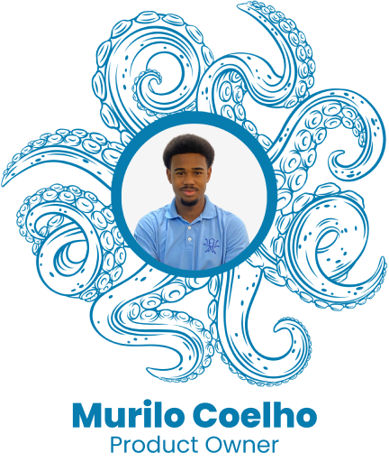
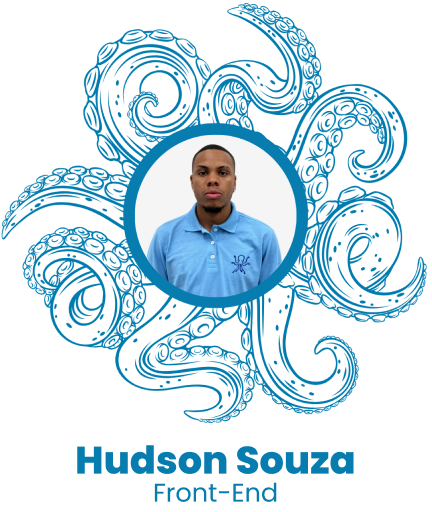
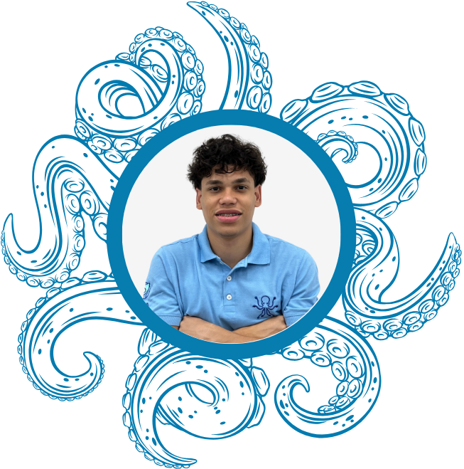
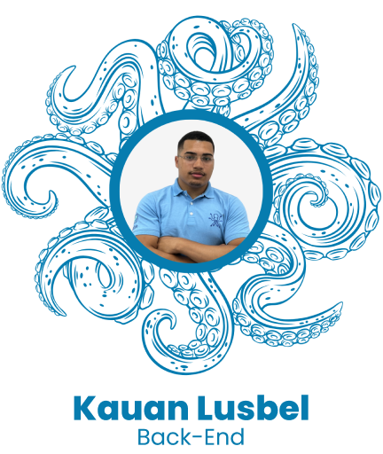
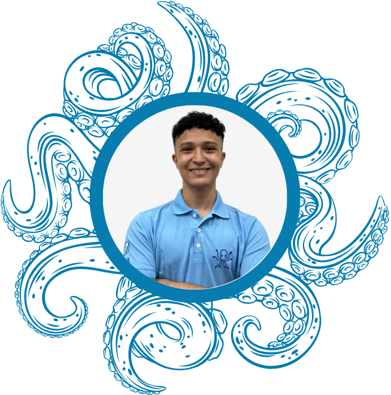

# Bem-vindo(a) à **DevEmpower** 🐙  

A **DevEmpower** é uma plataforma inovadora que capacita desenvolvedores, focando tanto em **soft skills** quanto em habilidades técnicas, preparando-os para enfrentar os desafios reais do mercado de trabalho de forma acessível e interativa.

---

## 🚀 **Nossa Missão**  
Capacitar novos profissionais da tecnologia para se destacarem no mercado, oferecendo uma abordagem prática centrada em desenvolvimento interpessoal e técnico.  

## 🌟 **Nossa Visão**  
Ser a plataforma líder em capacitação tecnológica, reconhecida por preparar desenvolvedores para superar os desafios dos processos seletivos e conquistar posições de destaque.  

## 💡 **Nossos Valores**  
- **Prática e Inovação**  
- **Ética e Transparência**  
- **Inclusão e Diversidade**  
- **Empatia e Colaboração**  

---

## 🌍 **Compromisso com o ODS 8**  
Estamos comprometidos com o Objetivo de Desenvolvimento Sustentável (ODS) 8, promovendo trabalho decente e crescimento econômico por meio da inclusão e capacitação de profissionais de tecnologia.

---

## 🛠️ **Funcionalidades Principais**  

### 1. **Materiais Interativos e Quizzes**  
Conteúdo dinâmico que simula cenários reais do mercado, permitindo o desenvolvimento de habilidades práticas.  

### 2. **Comunidade Ativa**  
Espaço para troca de experiências, networking e suporte contínuo com **mentores** e **profissionais da área**.  

### 3. **Mentorias Individuais**  
Apoio personalizado para integração e desenvolvimento contínuo no ambiente corporativo.

---

## 🎨 **Identidade Visual**  

Nossa identidade visual reflete **transparência** e **confiança**, com um design que prioriza a experiência do usuário.  

### **Pilares Fundamentais**  
- Transparência  
- Confiança  

### **Paleta de Cores**  

| Cor             | Código HEX | Exemplo              |
|-----------------|------------|----------------------|
| Uranian Blue    | #AEDFF7  |  |
| Celadon         | #A8D5BA  |  |
| White Smoke     | #F5F5F5  |  |
| Indigo Dye      | #005377  |  |  

---

## 🖋️ **Tipografia**  
Utilizamos a fonte **Poppins**, que oferece um equilíbrio entre **modernidade** e **acessibilidade**, proporcionando uma leitura clara e profissional.

---

## 🐙 **Símbolo do Polvo**  
O polvo representa a **versatilidade** e a **adaptabilidade** dos desenvolvedores, simbolizando as competências essenciais:  
- Linguagem de programação  
- Soft skills  
- Resolução de problemas  
- Inovação  

---

## 📢 **Nossa Equipe**  

Aqui estão os talentos por trás da DevEmpower:  

  <figure style="text-align: center;">
    
  </figure>

  <figure style="text-align: center;">
    
  </figure>

  <figure style="text-align: center;">
    
  </figure>

  <figure style="text-align: center;">
    
  </figure>

  <figure style="text-align: center;">
    
  </figure>

  <figure style="text-align: center;">
    
  </figure>

  <figure style="text-align: center;">
    
  </figure>

  <figure style="text-align: center;">
    
  </figure>

---
