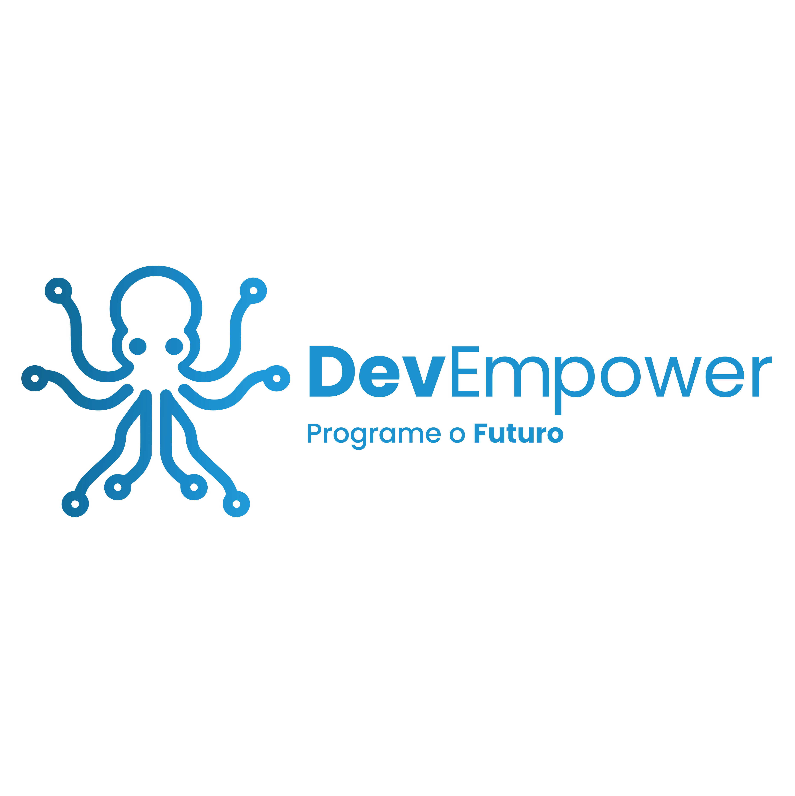

  

# Bem-vindo(a) à **DevEmpower** 🐙  

A **DevEmpower** é uma plataforma que aprimora habilidades interpessoais e técnicas de desenvolvedores, oferecendo capacitação acessível e interativa para superar desafios do mercado de trabalho.

---

## Missão  
Ajudar novos profissionais da tecnologia a se destacarem no mercado, oferecendo uma plataforma focada em **soft skills** e desenvolvimento profissional.  

## Visão  
Ser a plataforma de capacitação mais completa, preparando desenvolvedores para enfrentar desafios dos processos seletivos na área de tecnologia.  

## Valores  
- **Prática e Inovação**  
- **Ética e Transparência**  
- **Inclusão e Diversidade**  
- **Empatia**  
- **Colaboração**  

---

## ODS 8 - Trabalho Decente e Crescimento Econômico  
Nosso compromisso é contribuir para um mercado de trabalho mais inclusivo e preparado, alinhado aos objetivos de desenvolvimento sustentável.  

## Contexto
A DevEmpower prepara desenvolvedores para desafios do mercado, focando em soft skills como comunicação e trabalho em equipe, conectando talentos a empresas que valorizam diversidade e inovação.

---

## Funcionalidades Principais  

### 1. **Material de Aula e Quizzes Interativos**  
Conteúdos dinâmicos simulando situações reais do mercado, desenvolvendo habilidades práticas.  

### 2. **Comunidade**  
Espaço de troca de experiências, networking e suporte com **mentores**, **profissionais da área** e outros usuários.

### 3. **Mentorias Individuais**
as mentorias focam no desenvolvimento contínuo e na adaptação à cultura da empresa, auxiliando na integração e no sucesso dentro do ambiente corporativo.

---

## Identidade Visual  
Nossa identidade visual reflete **transparência** e **confiança**, com um design limpo que proporciona um ambiente agradável e focado na experiência do usuário.  

### **Pilares**  
- Transparência  
- Confiança  

### **Cores**  

| Cor             | Código HEX | Exemplo de Cor       |
|-----------------|------------|----------------------|
| Uranian Blue    | #AEDFF7  |  |
| Celadon         | #A8D5BA  |  |
| White Smoke     | #F5F5F5  |  |
| Indigo Dye      | #005377  |  |  

Essas cores transmitem inovação, confiança e comunicação eficaz, refletindo valores como **criatividade**, **liderança**, **empatia** e **objetividade**.

---

## Tipografia  
Utilizamos a fonte **Poppins**, que equilibra **profissionalismo** e **acessibilidade**, proporcionando uma leitura clara e moderna.

---

## Símbolo do Polvo 🐙  
O polvo simboliza a versatilidade e a força dos desenvolvedores. Cada tentáculo representa uma competência essencial, como:  
- Linguagem de programação  
- Soft skills  
- Resolução de problemas  
- Inovação  

Visualmente, o polvo apresenta linhas modernas e formas geométricas que remetem a **circuitos e conexões digitais**, unindo natureza multifuncional e tecnologia.

---
