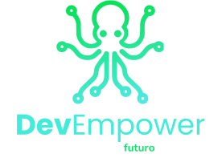
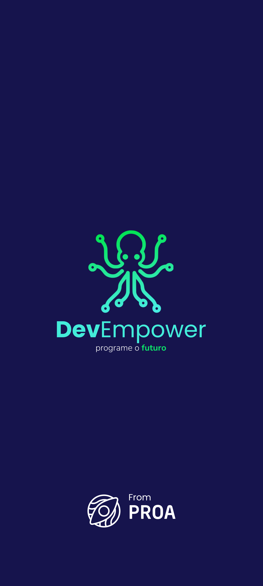
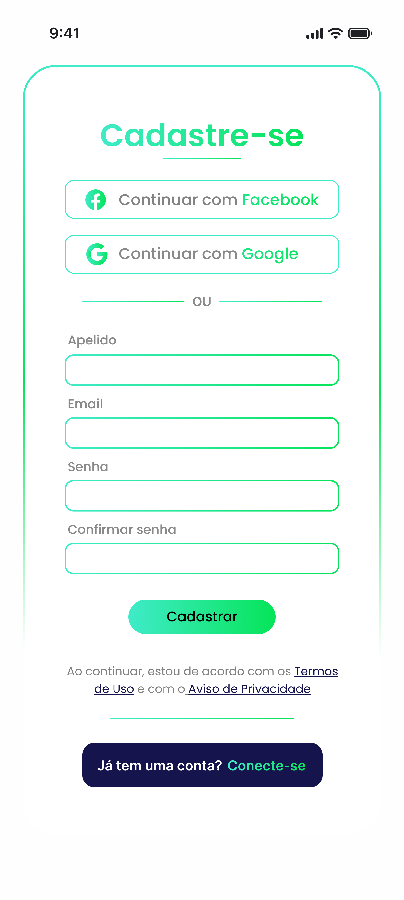
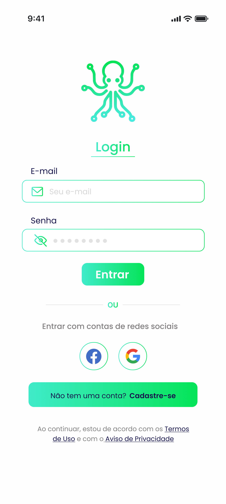
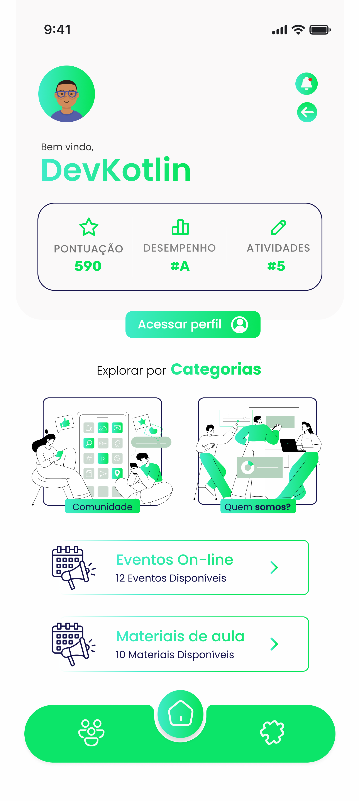
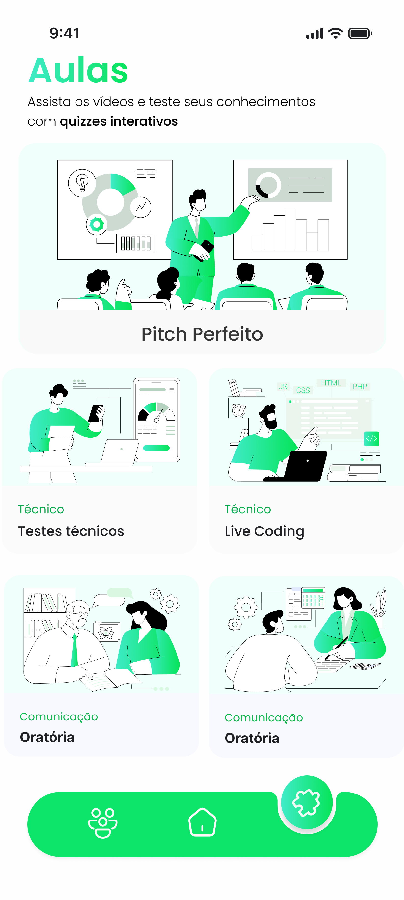
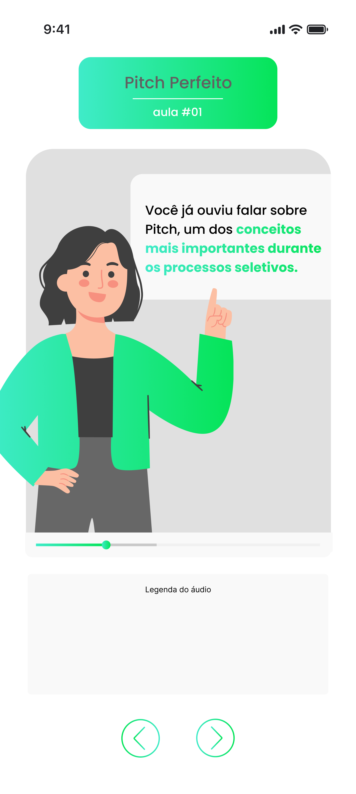
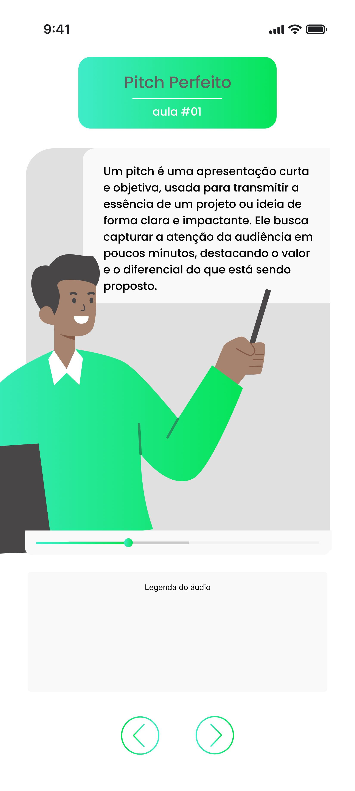
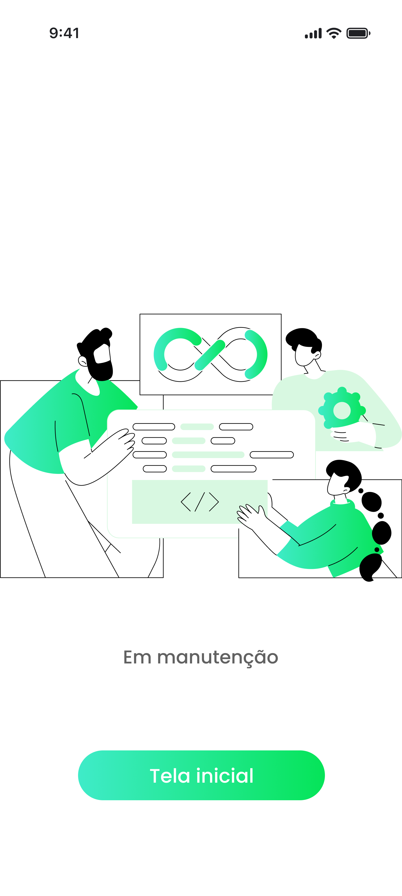
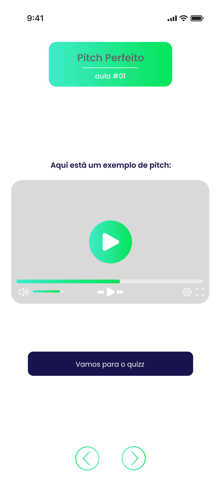

# DevEmpower 🐙
A **DevEmpower** é uma plataforma inovadora destinada a aprimorar as habilidades interpessoais e técnicas de desenvolvedores, preparando-os para os desafios do mercado de trabalho. Por meio de **simulações de entrevistas**, **materiais didáticos dinâmicos** e uma **comunidade de suporte**, a plataforma visa fortalecer a comunicação e a colaboração entre os profissionais da área.

# Futuro MVP
A DevEmpower está desenvolvendo um MVP (Produto Mínimo Viável) para testar a plataforma no mercado. Este MVP incluirá as principais funcionalidades, como materiais de aula, quizzes e simulações de entrevistas, além de contar com a parceria do **Grupo Carrefour** para conectar os usuários ao mercado real e proporcionar um ambiente prático de aprendizado.

## Funcionalidades Principais
### Material de Aula e Quizzes Interativos:
Fornece conteúdos dinâmicos que simulam situações reais do mercado, ajudando os usuários a desenvolver habilidades práticas.

### Comunidade:
Cria um espaço para troca de experiências e suporte entre desenvolvedores, promovendo **networking** e aprendizado colaborativo.

### Eventos Periódicos com Simulações Reais e Feedback em Tempo Real:
Oferece eventos periódicos com profissionais para aplicar os conhecimentos da plataforma. Feedbacks instantâneos são fornecidos por um sistema de IA, permitindo a melhoria contínua dos participantes.

# Identidade Visual
Nossa identidade visual foi criada com o intuito de transmitir **transparência** e **confiança**, mostrando que a plataforma tem o objetivo e a capacidade de ajudar a resolver os desafios dos desenvolvedores.
**Pilares**: Transparência e Confiança.

## Cores
| Cor             | Código HEX | Significado                                                 | Exemplo de Cor       |
|-----------------|------------|-------------------------------------------------------------|----------------------|
| Azul muito escuro | `#020634`  | Profundidade, confiança e seriedade.                                 |  |
| Roxo intenso       | `#5416be`  | Criatividade, sabedoria e inovação.                             |  |
| Azul claro      | `#2992f9`  | Frescor, comunicação e clareza.                        |  |
| Verde vibrante   | `#20C881`  | Energia, renovação, crescimento                             |  |
| Azul claro       | `#00ABFF`  | Sofisticação, profundidade, seriedade                      |  |

## Tipografia
**Poppins**, uma fonte que equilibra profissionalismo e acessibilidade!

## Símbolo do Polvo 🐙
O polvo representa **adaptabilidade** e **inteligência**, simbolizando a importância da **colaboração** e **comunicação** entre os desenvolvedores.

---

  <h1>Protótipo</h1>
  
  
  

    
    
    
    
    
    
    
    
    
    
  

